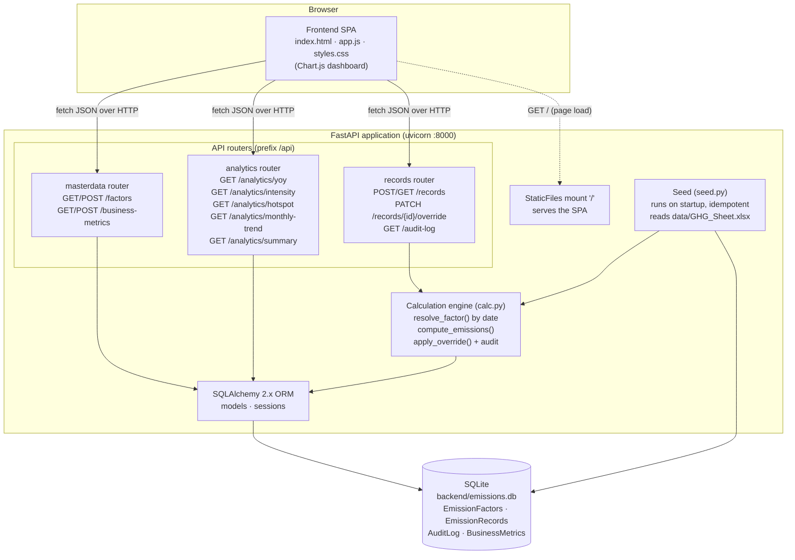
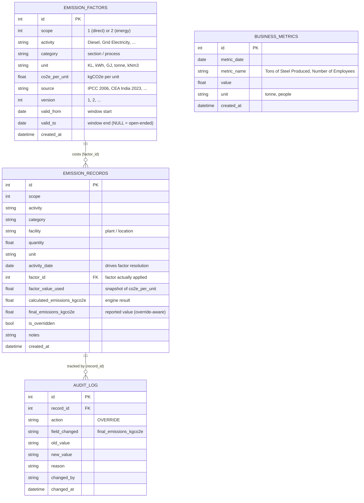

# Carbon Emissions Reporting Platform

A full-stack **GHG (Greenhouse Gas) accounting platform** that quantifies, stores
and analyses corporate carbon emissions under the **GHG Protocol Corporate
Standard**, covering **Scope 1** (direct emissions from owned/controlled sources
— fuel combustion, industrial processes) and **Scope 2** (indirect emissions
from purchased energy — grid electricity, imported steam).

The reference inventory models a heavy-industry emitter, *Central Steel Plant*,
derived from `data/GHG_Sheet.xlsx`. The platform turns raw activity data
(litres of diesel, kWh of grid power, tonnes of limestone) into auditable,
historically-accurate CO2-equivalent figures and the year-over-year, intensity
and hotspot analytics that a sustainability team needs for reporting.

> **One sentence:** *activity data × the emission factor that was valid on the
> activity's date = auditable kgCO2e, sliced by scope, source, facility and time.*

---

## Table of contents

1. [Key features](#key-features)
2. [Architecture](#architecture)
3. [Technology stack & rationale](#technology-stack--rationale)
4. [Database schema](#database-schema)
5. [Emission calculation engine](#emission-calculation-engine)
6. [Unit standardisation](#unit-standardisation)
7. [Manual overrides & audit trail](#manual-overrides--audit-trail)
8. [API reference](#api-reference)
9. [Seeded sample data](#seeded-sample-data)
10. [Running the platform](#running-the-platform)
11. [Project structure](#project-structure)

---

## Key features

- **GHG Protocol Scope 1 & 2** carbon accounting, stored consistently in
  **kgCO2e**.
- **Versioned emission factors** with `valid_from` / `valid_to` windows so each
  activity is costed with the factor that was correct *on its own date* —
  historical figures never silently change when a factor is updated.
- **Calculation engine** that resolves the right factor by date and persists both
  the computed value and the final reported value.
- **Manual overrides with an immutable audit trail** — every adjustment records
  the old value, new value, reason and author.
- **Rich analytics**: year-over-year totals, emission intensity (per tonne of
  steel and per employee), source hotspots, and a 12-month trend.
- **Self-seeding SQLite database** — a fresh start-up populates multi-year demo
  data (including *expired* factor versions) so the dashboard and analytics are
  immediately meaningful.
- **Single-container deployment** — the FastAPI backend serves both the JSON API
  and the static dashboard; `docker compose up --build` is the only command
  needed.

---

## Architecture

The system is a thin static **single-page frontend** talking to a **FastAPI**
backend organised into three routers. All write/read logic flows through a
**calculation engine** and a **SQLAlchemy 2.x** data-access layer onto a single
**SQLite** file. The same FastAPI process also serves the static frontend, so
there is exactly one deployable unit.



**Request lifecycle (creating a record):**

1. The SPA `POST`s an activity (`scope`, `activity`, `quantity`, `unit`,
   `activity_date`) to `/api/records`.
2. The **records router** hands the payload to the **calculation engine**.
3. `resolve_factor()` selects the `EmissionFactor` whose validity window contains
   `activity_date`; `compute_emissions()` multiplies `quantity × co2e_per_unit`.
4. The engine persists an `EmissionRecord` with both
   `calculated_emissions_kgco2e` and `final_emissions_kgco2e` (equal until an
   override is applied).
5. The **analytics router** later aggregates `final_emissions_kgco2e` for charts.

---

## Technology stack & rationale

| Layer | Choice | Why |
|-------|--------|-----|
| **Web framework** | **FastAPI** | Async, automatic OpenAPI/Swagger docs at `/docs`, first-class Pydantic validation. The auto-generated docs double as an interactive API reference for graders. |
| **Validation / schemas** | **Pydantic v2** | Strict request/response contracts (`ge`/`le` on scope, `gt=0` on quantity), serialisation straight from ORM objects via `from_attributes`. |
| **ORM** | **SQLAlchemy 2.x** (typed `Mapped[...]` style) | Versioned-factor queries and date-window resolution are expressed cleanly in the query layer; database-agnostic so SQLite → Postgres is a one-line URL change. |
| **Database** | **SQLite** | Zero-configuration, file-based, perfect for a self-contained assignment. Created and seeded automatically at startup; the data-access layer is portable to a server RDBMS unchanged. |
| **ASGI server** | **uvicorn** (`[standard]`) | Production-grade ASGI server; `--reload` for local dev. |
| **Data ingestion** | **pandas + openpyxl** | Reads the source `GHG_Sheet.xlsx` inventory and validates it during seeding. |
| **Frontend** | **Vanilla SPA (HTML/CSS/JS) + Chart.js** | No build step, no `node_modules`, no bundler — the static files are served directly by FastAPI. Keeps the whole platform a single deployable artifact. |
| **Packaging** | **Docker + docker-compose** | One image, one command (`docker compose up --build`); reproducible on any host. |

**Design principles**

- **Single deployable unit** — API and UI ship in one container; no CORS or
  reverse-proxy gymnastics required for the demo (CORS is nonetheless enabled
  for flexibility).
- **Historical correctness over convenience** — factors are versioned and never
  edited in place; recomputation always reflects the factor that was valid then.
- **Auditability by construction** — overrides are append-only audit entries, not
  destructive edits.
- **Portability** — nothing in the data layer is SQLite-specific; the same code
  runs against Postgres by changing `DATABASE_URL`.

---

## Database schema

Four tables back the platform. All emission magnitudes are stored in **kgCO2e**;
all factors are stored as **kgCO2e per activity unit**.



### `emission_factors` — the versioned factor library

The keystone of historical accuracy. The same `(scope, activity, unit)` can have
**multiple rows** with non-overlapping `[valid_from, valid_to]` windows. `valid_to
= NULL` means "currently in force". `factor_value_used` on a record is a frozen
snapshot of the `co2e_per_unit` that was applied, so a record's provenance is
self-contained even if the factor library later evolves.

### `emission_records` — quantified activities

One row per quantified activity. The engine stamps each record with the resolved
`factor_id`, a snapshot of the factor value, the computed
`calculated_emissions_kgco2e`, and `final_emissions_kgco2e` (which equals the
calculated value unless a human overrides it — see below). All analytics sum
`final_emissions_kgco2e`, so overrides are reflected everywhere automatically.

### `audit_log` — immutable change trail

Append-only. Every override writes a row capturing `old_value → new_value`, the
`reason`, the `changed_by` author and a timestamp. Nothing is ever updated or
deleted, so the full history of any record is reconstructable.

### `business_metrics` — denominators for intensity

Production volume (`Tons of Steel Produced`) and headcount (`Number of
Employees`), each stamped with a `metric_date`. These are the denominators for
emission-intensity analytics (kgCO2e per tonne of steel, kgCO2e per employee).

---

## Emission calculation engine

The engine (`backend/app/calc.py`) is the heart of the platform. The core
formula is intentionally simple:

```
emissions_kgCO2e = quantity × co2e_per_unit
```

The intelligence is in **which** `co2e_per_unit` is used.

### Historical accuracy — the factor valid *at the activity date*

Emission factors change over time (fuel specifications change, grids
decarbonise, methodologies are revised). A platform that always applied *today's*
factor would silently rewrite history every time a factor was updated — making
year-over-year comparisons meaningless and reports non-reproducible.

Instead, `resolve_factor()` selects the factor whose validity window **contains
the activity's own date**:

```sql
SELECT * FROM emission_factors
WHERE scope = :scope
  AND activity = :activity
  AND valid_from <= :activity_date
  AND (valid_to IS NULL OR valid_to >= :activity_date)
ORDER BY valid_from DESC      -- most specific (latest-starting) window wins
LIMIT 1;
```

So a January-2023 diesel record is costed with the 2022–2023 factor, while a
June-2024 diesel record uses the post-2024 factor — automatically, and forever.

### Worked example — same activity, two years, two answers

The seed registers **two versions** of the Scope 1 *Diesel* factor (values in
kgCO2e/KL after [unit standardisation](#unit-standardisation)):

| Version | Validity window | Factor (kgCO2e/KL) | Note |
|---------|-----------------|--------------------|------|
| v1 (expired) | 2022-01-01 → 2023-12-31 | **1862.42** | ~6% higher (pre-2024 fuel spec) |
| v2 (current) | 2024-01-01 → *open* | **1757.00** | current factor |

Now consider the **identical** activity — *200 KL of diesel* — booked in two
different years:

| Activity | Date | Resolved factor | Calculation | Emissions |
|----------|------|-----------------|-------------|-----------|
| 200 KL Diesel | **2023-06-15** | v1 = 1862.42 | 200 × 1862.42 | **372,484 kgCO2e** |
| 200 KL Diesel | **2024-06-15** | v2 = 1757.00 | 200 × 1757.00 | **351,400 kgCO2e** |

The same physical activity yields **different emissions** purely because the
governing factor changed — and the 2023 figure is *locked* to the 2023 factor
even after v2 is introduced. This is exactly the behaviour an auditor expects.

### What happens when no factor matches

If no factor covers the date/activity, the engine first retries with a
unit-agnostic match (to tolerate minor unit-string differences). If there is
still no match, the record is stored with **zero** emissions and a note is added
so the UI can flag it — nothing is silently dropped.

---

## Unit standardisation

The source workbook stores emission factors in **tCO2 per unit** (and its mock
values are deliberately inflated). To keep arithmetic consistent and avoid mixed
units across the database, the platform standardises **everything to kgCO2e** at
seed time:

```
co2e_per_unit (kgCO2e/unit) = sheet value (tCO2/unit) × 1000
```

For example the workbook's diesel factor of `1.757 tCO2/KL` becomes
`1757.0 kgCO2e/KL`. Consequently **every** stored emission magnitude
(`calculated_emissions_kgco2e`, `final_emissions_kgco2e`) and every analytics
figure is expressed in **kgCO2e**, with no per-row unit ambiguity.

---

## Manual overrides & audit trail

Sustainability teams occasionally need to correct a computed value (a meter was
faulty, a supplier issued a restated factor, a one-off adjustment is agreed with
the auditor). The platform supports this **without destroying the original
computation**:

- `EmissionRecord.calculated_emissions_kgco2e` always preserves what the engine
  computed.
- `EmissionRecord.final_emissions_kgco2e` is the value actually reported; an
  override sets this and flips `is_overridden = true`.
- Every override appends an immutable **`AuditLog`** row:
  `action="OVERRIDE"`, `field_changed`, `old_value`, `new_value`, `reason`,
  `changed_by`, `changed_at`.

Because all analytics aggregate `final_emissions_kgco2e`, an override propagates
into YoY, intensity, hotspot and trend figures automatically — while the audit
log preserves a complete, queryable change history (`GET /api/audit-log`).

---

## API reference

Base URL: `http://localhost:8000`. All endpoints are under the `/api` prefix and
return JSON. Interactive Swagger UI is available at **`/docs`** and ReDoc at
**`/redoc`**.

### Meta

#### `GET /api/health`

Liveness probe.

```json
{ "status": "ok", "service": "carbon-emissions-platform" }
```

---

### Core — records, overrides & audit

#### `POST /api/records` → `201 Created`

Create a Scope 1 or Scope 2 emission record. The payload is routed through the
calculation engine, which resolves the historically-correct factor for
`activity_date` and computes emissions in kgCO2e.

**Body**

```json
{
  "scope": 1,
  "activity": "Diesel",
  "category": "Pellet Plant",
  "facility": "Central Steel Plant",
  "quantity": 200,
  "unit": "KL",
  "activity_date": "2024-06-15",
  "notes": "Q2 pellet plant refuelling"
}
```

**Response**

```json
{
  "id": 421,
  "scope": 1,
  "activity": "Diesel",
  "category": "Pellet Plant",
  "facility": "Central Steel Plant",
  "quantity": 200.0,
  "unit": "KL",
  "activity_date": "2024-06-15",
  "factor_id": 2,
  "factor_value_used": 1757.0,
  "calculated_emissions_kgco2e": 351400.0,
  "final_emissions_kgco2e": 351400.0,
  "is_overridden": false,
  "notes": "Q2 pellet plant refuelling",
  "created_at": "2026-06-23T10:15:00"
}
```

#### `GET /api/records`

List records, newest activity first.

| Query param | Type | Description |
|-------------|------|-------------|
| `year` | int | Filter by activity year |
| `scope` | int (1–2) | Filter by scope |
| `activity` | string | Filter by activity name |
| `limit` | int (1–5000, default 500) | Max rows |

**Response:** array of record objects (same shape as above).

#### `GET /api/records/{record_id}`

Fetch a single record; `404` if not found.

#### `PATCH /api/records/{record_id}/override`

Apply a manual override to a record's reported emissions. Sets
`final_emissions_kgco2e`, flips `is_overridden`, and writes an `AuditLog` entry.

**Body**

```json
{
  "override_value": 360000.0,
  "reason": "Meter recalibration adjustment agreed with auditor",
  "changed_by": "j.doe@centralsteel.example"
}
```

**Response:** the updated record with `is_overridden: true` and the new
`final_emissions_kgco2e` (note `calculated_emissions_kgco2e` is unchanged).

#### `GET /api/audit-log`

Return the audit trail, newest first. Optional `?record_id=` filters to one
record.

```json
[
  {
    "id": 1,
    "record_id": 421,
    "action": "OVERRIDE",
    "field_changed": "final_emissions_kgco2e",
    "old_value": "351400.0",
    "new_value": "360000.0",
    "reason": "Meter recalibration adjustment agreed with auditor",
    "changed_by": "j.doe@centralsteel.example",
    "changed_at": "2026-06-23T10:20:00"
  }
]
```

---

### Master data — factors & business metrics

#### `GET /api/factors`

List emission factors with their versions and validity windows (ordered by
activity then `valid_from`, so expired versions precede current ones). Optional
`?scope=` and `?activity=` filters.

```json
[
  {
    "id": 1, "scope": 1, "activity": "Diesel", "category": "Pellet Plant",
    "unit": "KL", "co2e_per_unit": 1862.42, "source": "IPCC 2006 Guidelines",
    "version": 1, "valid_from": "2022-01-01", "valid_to": "2023-12-31",
    "created_at": "2026-06-23T10:00:00"
  },
  {
    "id": 2, "scope": 1, "activity": "Diesel", "category": "Pellet Plant",
    "unit": "KL", "co2e_per_unit": 1757.0, "source": "IPCC 2006 Guidelines",
    "version": 2, "valid_from": "2024-01-01", "valid_to": null,
    "created_at": "2026-06-23T10:00:00"
  }
]
```

#### `POST /api/factors` → `201 Created`

Add a new factor version (e.g. to "close" a current factor and introduce a new
one for a future date). Body mirrors the factor fields above; `co2e_per_unit` is
in **kgCO2e/unit**.

#### `GET /api/business-metrics`

List business metrics (ordered by date). Optional `?metric_name=` and `?year=`.

```json
[
  { "id": 1, "metric_date": "2023-12-31", "metric_name": "Tons of Steel Produced",
    "value": 1180000.0, "unit": "tonne", "created_at": "2026-06-23T10:00:00" }
]
```

#### `POST /api/business-metrics` → `201 Created`

Add a business metric (drives intensity denominators).

---

### Analytics

All analytics aggregate `final_emissions_kgco2e` (override-aware) and return
kgCO2e. The figures below are produced by the [seeded data](#seeded-sample-data).

#### `GET /api/analytics/yoy?year={year}`

Year-over-year totals by scope (drives the stacked-bar chart).

```json
{
  "year": 2024,
  "prev_year": 2023,
  "current":  { "scope1": 2785629787.2, "scope2": 33141700800.0, "total": 35927330587.2 },
  "previous": { "scope1": 2584092098.4, "scope2": 33473640000.0, "total": 36057732098.4 },
  "change_pct": -0.36
}
```

#### `GET /api/analytics/intensity?year={year}&metric={metric}`

Emission intensity = total kgCO2e ÷ production, with prior-year comparison and a
per-employee figure. `metric` defaults to `Tons of Steel Produced`.

```json
{
  "year": 2024,
  "metric": "Tons of Steel Produced",
  "total_kgco2e": 35927330587.2,
  "production_value": 1310000.0,
  "production_unit": "tonne",
  "intensity_kgco2e_per_unit": 27425.4432,
  "prev_year_intensity": 30557.4001,
  "change_pct": -10.25,
  "employees": 2520.0,
  "intensity_kgco2e_per_employee": 14256877.2171
}
```

> Intensity falls ~10% YoY even though absolute emissions are roughly flat —
> because production grew faster than emissions. This is the headline ESG story
> the dashboard tells.

#### `GET /api/analytics/hotspot?year={year}`

Emissions broken down by source/activity, sorted descending (donut chart).

```json
[
  { "source": "Grid Electricity",  "scope": 2, "kgco2e": 20217600000.0, "pct_of_total": 56.27 },
  { "source": "Open Access Power",  "scope": 2, "kgco2e": 8501760000.0,  "pct_of_total": 23.66 },
  { "source": "Captive Solar+Grid", "scope": 2, "kgco2e": 2566080000.0,  "pct_of_total": 7.14 }
]
```

#### `GET /api/analytics/monthly-trend?year={year}`

Per-month scope1 / scope2 / total for the line chart. Always returns a full
12-point axis (empty months are zeros).

```json
[
  { "month": 1, "month_name": "Jan", "scope1": 228266885.34, "scope2": 2715778260.0, "total": 2944045145.34 }
]
```

#### `GET /api/analytics/summary?year={year}&metric={metric}`

Combined KPI-card payload (totals, top hotspot, intensity, record count).

```json
{
  "year": 2024,
  "total_kgco2e": 35927330587.2,
  "scope1_kgco2e": 2785629787.2,
  "scope2_kgco2e": 33141700800.0,
  "top_hotspot": { "source": "Grid Electricity", "scope": 2, "kgco2e": 20217600000.0, "pct_of_total": 56.27 },
  "intensity_kgco2e_per_unit": 27425.4432,
  "intensity_metric": "Tons of Steel Produced",
  "record_count": 168
}
```

---

## Seeded sample data

On first startup the (idempotent) seed populates a realistic, multi-year demo
inventory for *Central Steel Plant*. Running again is a no-op once factors exist.

| Entity | Count | Detail |
|--------|-------|--------|
| **Emission factors** | **19** | 14 Scope 1/2 activities; **5 of them carry an expired older version** (2022-01-01 → 2023-12-31) plus a current open-ended version (2024-01-01 → ∞). |
| **Emission records** | **420** | Monthly records across all 14 activities for **2023 (168)**, **2024 (168)** and **2025 H1 (84)** — every record created *through the engine* so factor-by-date resolution is genuinely exercised. |
| **Business metrics** | **6** | `Tons of Steel Produced` and `Number of Employees`, one row per year (2023/2024/2025), both growing year over year. |

**Versioned factors with expired versions.** Diesel, Natural Gas, Grid
Electricity, Open Access Power and Captive Solar+Grid each have an expired v1 and
a current v2. The older versions are deliberately set higher (or lower for
decarbonising grids) so that records straddling the 2023/2024 boundary produce a
**genuine, factor-driven YoY delta** — not just a quantity change.

**Multi-year records.** Activity quantities grow ~8% from 2023→2024 (production
ramp) and 2025 is a partial year (H1 only), with a light seasonal wobble so the
monthly trend chart is not flat.

**Business metrics.** Steel production rises 1.18 Mt → 1.31 Mt and headcount
2,400 → 2,520 from 2023 to 2024 — the denominators that make intensity fall
~10% YoY even while absolute emissions stay roughly flat.

**Unit standardisation in the seed.** The workbook's factors (tCO2/unit) are
multiplied by 1000 and stored as kgCO2e/unit (e.g. diesel `1.757 → 1757.0`).

> All numbers in the [API reference](#api-reference) above are the actual values
> produced by this seed, so the README stays in lock-step with the running app.

---

## Running the platform

### Option A — Docker (recommended)

Prerequisites: Docker Desktop (or Docker Engine + Compose v2).

```bash
# from the project root (where docker-compose.yml lives)
docker compose up --build
```

Then open:

- **Dashboard:** <http://localhost:8000>
- **Interactive API docs (Swagger):** <http://localhost:8000/docs>
- **Health check:** <http://localhost:8000/api/health>

The container creates the SQLite database and seeds the demo data on first start
(watch the `[seed] ...` log lines). To stop:

```bash
docker compose down            # stop and remove the container
docker compose down -v         # also remove the persisted database volume
```

> The compose file mounts a named volume at `/app/backend` so the seeded
> database (and any records/overrides you create) survive restarts. Remove the
> `volumes:` block, or run `docker compose down -v`, to get a freshly-seeded
> database every time.

### Option B — Local development (no Docker)

Prerequisites: **Python 3.11+**.

```bash
# 1. Create and activate a virtual environment
python -m venv .venv
# Windows (PowerShell):
.venv\Scripts\Activate.ps1
# macOS / Linux / Git Bash:
source .venv/bin/activate

# 2. Install dependencies
pip install -r requirements.txt

# 3. Run the API (creates + seeds the database on startup)
python -m uvicorn backend.app.main:app --reload
```

Then open <http://localhost:8000> (dashboard) and <http://localhost:8000/docs>.

Notes:

- Run uvicorn **from the project root** so `backend.app.main:app` resolves.
- The SQLite file is created at `backend/emissions.db`; it is gitignored and
  recreated from the seed if deleted. Delete it to force a clean re-seed.

---

## Project structure

```
carbon-emissions-platform/
├── backend/
│   ├── app/
│   │   ├── __init__.py
│   │   ├── database.py          # SQLite engine, session, Base, get_db dependency
│   │   ├── models.py            # ORM: EmissionFactor, EmissionRecord, AuditLog, BusinessMetric
│   │   ├── schemas.py           # Pydantic v2 request/response models
│   │   ├── calc.py              # Calculation engine: resolve_factor, compute, override
│   │   ├── seed.py              # Idempotent multi-year seed (reads GHG_Sheet.xlsx)
│   │   ├── main.py              # FastAPI app: lifespan seed, routers, static mount
│   │   └── routers/
│   │       ├── __init__.py
│   │       ├── records.py       # Core: records CRUD, override, audit-log
│   │       ├── masterdata.py    # Factors (versioned) & business metrics
│   │       └── analytics.py     # yoy, intensity, hotspot, monthly-trend, summary
│   ├── emissions.db             # SQLite DB (gitignored, created at runtime)
│   └── README.md                # Backend-focused notes
├── frontend/
│   ├── index.html               # Dashboard shell
│   ├── app.js                   # Fetches /api/... and renders Chart.js views
│   └── styles.css               # Styling
├── data/
│   └── GHG_Sheet.xlsx           # Source GHG inventory (Scope 1 & 2 reference)
├── requirements.txt             # Python dependencies
├── Dockerfile                   # python:3.11-slim image, uvicorn entrypoint
├── .dockerignore                # Excludes caches, *.db, .git, venvs, ...
├── docker-compose.yml           # Single "app" service, ports 8000:8000
├── .gitignore
└── README.md                    # (this file)
```

---

*Built for GHG Protocol Scope 1 & 2 carbon accounting. All emissions stored and
reported in kgCO2e.*
